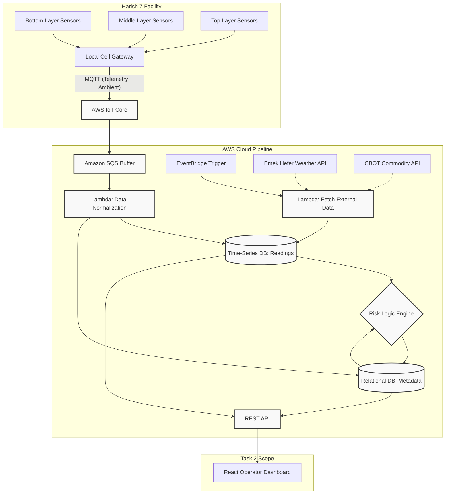

# AgriQ Harish 7 Grain Monitoring Dashboard

## System Architecture (Task 1)
Below is the High-Level Architecture (HLA) detailing the data ingestion, hybrid storage, and processing pipeline for the 120 sensor balls.

*For a detailed explanation of the pipeline, decoupled message queuing, and database structure, please see `design.md`.*



---

## Operator Dashboard (Task 2)
This repository contains the interactive frontend dashboard built to visualize the telemetry data and active alerts described in the architecture above.

### Core Features
* **Global Sites Overview:** High-level status cards displaying aggregated telemetry and system health for all 4 grain piles(clickable).
* **Hardware Drill-down Map:** Interactive modal mapping the 30-sensor arrays within individual piles to locate localized heat/moisture anomalies across Bottom, Middle, and Top layers.
* **Active Alerts Center:** An aggregated data table filtering all out-of-bounds and erratic sensors across the facility into a single actionable list for the operator.

### Technology Stack
* **Framework:** React 18 + TypeScript
* **Build Tool:** Vite (for fast HMR and optimized builds)
* **Styling:** Tailwind CSS (Pure utility-first approach for speed and stability)
* **Routing:** React Router DOM

### Local Development Setup

#### Prerequisites
Make sure you have [Node.js](https://nodejs.org/) installed on your machine.

#### Installation & Running
1. Clone the repository and navigate into the application folder:
   ```bash
   cd dashboard
   ```
2. Install the core dependencies:
   ```bash
   npm install
   ```
3. Start the development server:
    ```bash
    npm run dev
    ```
4. Open your browser and navigate to the local URL provided in the terminal (usually `http://localhost:5173`).