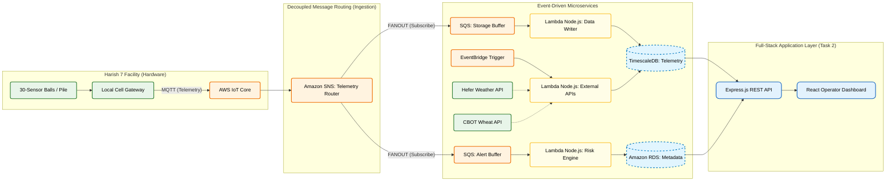

## agriQ System Architecture (Task 1)
Below is the High-Level Architecture (HLA) detailing the data ingestion, microservices routing, and storage pipeline for the 120 sensor balls.

*For a detailed explanation of the pipeline, decoupled message queuing, and database structure, please see `design.md`.*


---

## Operator Dashboard & API (Task 2)
This repository contains the interactive frontend dashboard and the supporting backend API built to visualize the telemetry data and active alerts described in the architecture above.

### Core Features
* **Global Sites Overview:** High-level status cards displaying aggregated telemetry and system health for all 4 grain piles (clickable).
* **Hardware Drill-down Map:** Interactive modal mapping the 30-sensor arrays within individual piles to locate localized heat/moisture anomalies across Bottom, Middle, and Top layers.
* **Active Alerts Center:** An aggregated data table filtering all out-of-bounds and erratic sensors across the facility into a single actionable list for the operator.

### Technology Stack
* **Frontend Framework:** React 18 + TypeScript
* **Backend API:** Node.js + Express.js
* **Build Tool:** Vite (for fast HMR and optimized builds)
* **Styling:** Tailwind CSS (Pure utility-first approach for speed and stability)
* **Routing:** React Router DOM

### Local Development Setup

#### Prerequisites
Make sure you have [Node.js](https://nodejs.org/) installed on your machine. To run this project locally, you will need two separate terminal windows.

#### 1. Start the Backend API
Open your first terminal, navigate to the `server` directory, install dependencies, and start the server:
```bash
cd server
npm install
npm run dev
```

You can see the mock data by going to `http://localhost:5001/api/piles`

#### 2. Start the Frontend Dashboard
Open a second terminal, navigate to the `dashboard` directory, install dependencies, and launch the development server:
```bash
cd dashboard
npm install
npm run dev
```

Open your browser and navigate to the local URL provided in the terminal (usually `http://localhost:5173`).